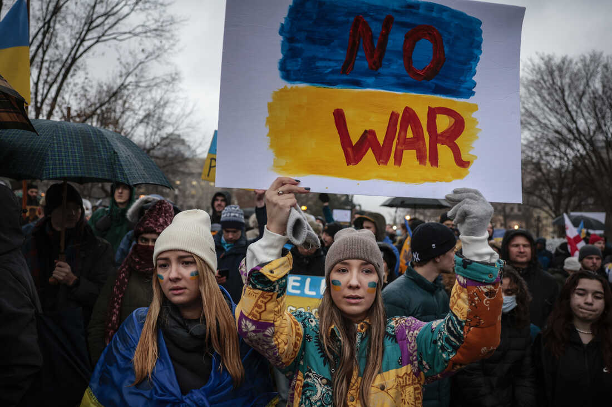
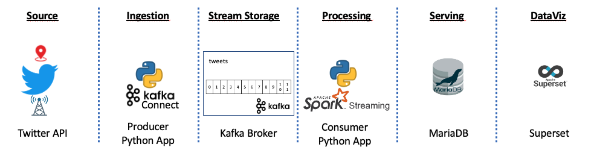
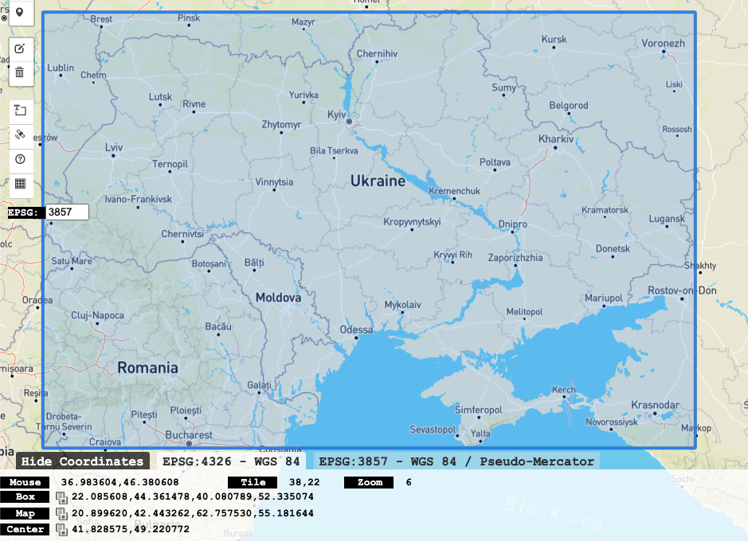

# Ukraine_tweets




# Project Motivation

Thursday, February 24, 2022 Russian army invades Ukraine and marks the beginning of a war that threatens Western countries, accompanied by a humanitarian refugee crisis. The purpose of this project is to obtain information from Ukrainian tweets for future analysis. One of the limitations to using Twitter is that only about 1% of tweets are geotagged with the tweet's location, which can make much of this work very difficult.

### Assignment Description
Our dearly Stream Processing & Real-Time Analytics professor Raul Marín has proposed us a challenge. To deploy an end-to-end real-time solution following the next stages throughout the pipeline:<br>
  1- Select the **Data Source**: Twitter API.<br>
  2- **Ingestion**: Producer - Python app.<br>
  3- **Stream Storage**: Broker - Kafka.<br>
  4- **Processing**: Consumer - Spark Streaming.<br>
  5- **Serving**: Relational DB - MariaDB.<br>
  6- **Visualization**: Superset.<br>

### Who are we?
IE Students of the MSc Business Analytics & Big Data. Team Power Rangers:
  - Isobel Rae Impas
  - Jan P. Thoma
  - Nikolas Artadi
  - Camila Vasquez
  - Santiago Alfonso Galeano
  - Miguel Frutos

# Ukraine_tweets
### 1- Select the Data Source: Twitter API
Setting up Twitter. You need to create a "Twitter App". Follow the next steps:
- Visit [Projects & Apps](https://developer.twitter.com/en/portal/projects-and-apps) section in the Developer Portal
- Sign into your account. (if you don't have one you should create it).
- Click the “Create an app” button.
- Fill-in the form (at least the required fields).
- Grab the details to setup the ingestion script later on.
- If all goes well, your Twitter App should be created and the API Key, API Secret Key will show up.
- The Access Token and Access Token Secret will be also needed.

Fill up the **credentials.ini** file with the required fields.

### 2- Ingestion - Producer (Python app)
[Tweepy](http://www.tweepy.org/)  is a python wrapper for the Twitter API that allowed us to easily collect tweets in real-time.

Initiate the Kafka broker in the terminal:
```
sudo service kafka start
sudo service kafka status
```
The following python script is the producer, named as twitter_producer.py, we will use it to ingest the tweets into Kafka topic "tweets". To call it we should write in our terminal the following piece of code.

```
python3 twitter_producer.py credentials.ini -b localhost:9092 -t tweets
```
FILE *(twitter_producer.py)* :
```python
"""
Description: Scan the latest twitter feeds originating from a particular country, using Twitter’s Streaming API. The program creates a json file which stores raw twitter streams for an specific bounding box.

Required Packages: tweepy, argparse, time, string, json, prettytable

Usage: python3 twitter_producer.py credentials.ini -b localhost:9092 -t tweets

Note: Fill up the variable in credentials.ini which contains data path and twitter app credentials.
Note: Fill up the LOCATION variable for changing the country bounding box. By default for this project would be "Ukraine".

"""
import configparser, argparse, logging, socket, tweepy, socket, sys

from confluent_kafka import Producer
from tweepy.streaming import Stream

# Auxiliary classes
#
class TwitterStreamListener(tweepy.Stream):
    """tweepy.Stream is a class provided by tweepy used to access
    the Twitter Streaming API to collect tweets in real-time.
    """
    _kafka_producer = None
    _topic = None
    
    def connect_to_kafka(self, broker, topic):
        """The Producer is configured using a dictionary. Added the topic inside the funtion"""
        conf = {'bootstrap.servers': broker,
                'client.id': socket.gethostname()}        
        self._kafka_producer = Producer(conf)
        self._topic = topic
  
    def on_data(self, data):
        """Add the logic you want to apply to the data. This method is called whenever new data arrives from live stream.
        We synchronously push this data to kafka queue (using produce and flush)"""
        if self._kafka_producer!=None:
            self._kafka_producer.produce(self._topic, value=data) #method enqueues message immediately for batching, compression and transmission to broker, no delivery notification events will be propagated until flush() is invoked.
            self._kafka_producer.flush() #Wait for all messages in the Producer queue to be delivered. This is a convenience method that calls poll() until len() is zero or the optional timeout elapses. flush() will block until the previously sent messages have been delivered (or errored), effectively making the producer synchronous.
            logging.debug(f"tweet: {data}")
        else:
            print(data)

    def on_error(self, status):
        """On error - if an error occurs, display the error / status"""
        #logging.error(status)
        print("Error received in kafka producer " + repr(status))
        return sys.exit(-1) ## Don't kill the stream. tells the program to quit,it stops from continuoing the execution
 
   
# Body of the scripts       
#
if __name__ == '__main__':
    #Parse the argument given in the commandline
    logging.basicConfig(level=logging.INFO) #Logging is a means of tracking events that happen when some software runs
    parser = argparse.ArgumentParser(description="Scanning Twitter Stream")
    parser.add_argument("credentials_file", 
                         help="path to the file with info to access the service")
    parser.add_argument("-b", "--broker",
                            help="server:port of the Kafka broker where messages will be published")
    parser.add_argument("-t", "--topic",
                            help="topic where messages will be published")  
    args = parser.parse_args()   

  # Read credentials.ini to connect to the Twitter Stream
  #
    credentials = configparser.ConfigParser()
    credentials.read(args.credentials_file)
        
    API_key = credentials['DEFAULT']['API_key']
    API_secret = credentials['DEFAULT']['API_secret']
    access_token = credentials['DEFAULT']['access_token']
    access_secret = credentials['DEFAULT']['access_secret']
    
  # Twitter connection and Kafka producer initialization
  #  
    twitter_conn = TwitterStreamListener(API_key, API_secret,
                                         access_token, access_secret)
    
  # Initialize the Kafka producer if broker and topic was specified
if args.broker != None and args.topic != None:
    twitter_conn.connect_to_kafka(args.broker, args.topic)
    # Start the filtering. Bounding Boxes by country : https://gist.github.com/graydon/11198540
    # LOCATIONS are the longitude, latitude coordinate corners for a box that restricts the 
    # geographic area from which you will stream tweets. The first two define the southwest
    # corner of the box and the second two define the northeast corner of the box. 
    LOCATION = (22.0856083513, 44.3614785833, 40.0807890155, 52.3350745713) #Ukraine
    twitter_conn.filter(locations=LOCATION)
    twitter_conn.sample()

```
Twitter Development Platform opens the possibility to filter with some standard parameters the information we are ingesting. Through the [".filter()"](https://developer.twitter.com/en/docs/twitter-api/v1/tweets/filter-realtime/guides/basic-stream-parameters) method (at the end of the script) we are filtering the tweets posted in a bounding box specific for the Ukraine region. As you can see... we are taking a snapshot that are including regions of other countries... therefore, in the processing (consumer) layer we will have to remove those tweets.


<p align="center">


### 3- Stream Storage: Broker (Kafka)
The Kafka broker receives the tweets from the Kafka Producer and stores them on disk keyed by unique offset. It will allow the Spark Consumer to fetch the tweets by topic, in this case the topic is called “tweets”, which will be divided in partitions and offsets.

Kafka brokers can create a Kafka cluster by sharing information between each other directly or indirectly. The Kafka cluster has exactly one broker that acts as the Controller.


### 4- Processing: Consumer (Spark Streaming)
```python
"""
Description: Receiving the tweets coming from Kafka Broker. Processing the tweets posted in Ukraine. The tweets will be uploaded in a MariaDB database.

Required Packages: configparser, argparse, findspark, os, SparkContext, SparkSession, split, col, window, concat, lit, TimestampType

Usage: python3 twitter_consumer.py twitter_consumer_config.ini

"""

#To read conf. file
import configparser
#To read arg. from command line
import argparse

#Search Spark Installation. This step is required just because we are working in the course environment.
import findspark
findspark.init()

#Sending to the Spark Cluster the main program. It'll execute the script and during the execution the code will be optimized by Catalist and then, the code will be executed in the executors and coordinated by the driver process.
import os
os.environ['PYSPARK_SUBMIT_ARGS'] = '--packages "org.apache.spark:spark-sql-kafka-0-10_2.12:3.0.3" pyspark-shell'

#To initiate our Spark Session
from pyspark.context import SparkContext
from pyspark.sql import SparkSession

from pyspark.sql.functions import split, col, window, concat, lit
from pyspark.sql.types import TimestampType

#This function is providing the schema for each event or batch and connecting it to an external MariaDB database.
def foreach_batch_function(df, epoch_id, config):
    print ("Batch %d received" % epoch_id)
    
    url = config['DEFAULT']['rdbms_url']
    table = config['DEFAULT']['rdbms_table']
    mode = "append"
    props = {"user":config['DEFAULT']['rdbms_user'],
             "password":config['DEFAULT']['rdbms_password']} 
    
    df.select("event_time", "screen_name", "text", "hashtags", 
              "coordinates", "country", "country_code","location") \
      .write \
      .jdbc(url,table,mode,props) 
    #data source

if __name__ == '__main__':

    parser = argparse.ArgumentParser()
    parser.add_argument("configuration_file", 
                        help="configuration file with all the information to run the job")
    args = parser.parse_args()
    
    print ("The streaming_consumer_template is about to start...")
    
    # Read the configuration file to setup the Spark Streaming Application (job)
    #
    print ("   - Reading the configuration of my Spark Streaming Application.")
    config = configparser.ConfigParser()
    config.read(args.configuration_file)
    
    # Create a SparkSession to run our Spark Streaming Application (job)
    #
    print ("   - Creating the Spark Session that will allow me to interact with Spark.")
    sc = SparkSession.builder\
        .master('local')\
        .appName('groupassignment')\
        .getOrCreate()

    # Logic of our Spark Streaming Application (job)
    #

    # Get the configurations for our use case
    kafka_input_topic = config['DEFAULT']['kafka_input_topic']
    kafka_group_id = config['DEFAULT']['kafka_group_id']
    
    # Build the DataFrame from the source
    
    #Building the rawEventsDF DataFrame with data coming from Kafka.\
    #Have a look at the schema you get by default when you create a DataFrame on top of a Kafka topic.\
    #The value field is the one containing the data from the ingestion layer, the Twitter producer in our case.\
    #Bear in mind thataAs we're simplifying things, we're not relying on schemas and we're sending sequence of\
    #bytes to Kafka topics.\
    #Later in the notebook, we're going to convert that sequence of bytes in a proper JSON document \
    #representing every tweet as it was received.")
    rawTweetsDF = sc.readStream \
                       .format("kafka") \
                       .option("kafka.bootstrap.servers", "localhost:9092") \
                       .option("subscribe", "tweets") \
                       .option("startingOffsets", "latest") \
                       .load()\
 
    #Map the sequence of bytes to a Dataframe.\
    #We're going to apply the following logic to the events we get from the topic:\
    #1- Define the schema that matches the raw sequence of bytes we get from the topic.\
    #2- Cast the default data type of the field value (byte) to the String data type.\
    #3- Convert the String into a proper JSON document by using the from_json function.\
    #4- Flatten the JSON file and display event time, user name, text and the id.\

             
    ## 1- Define the schema that matches the raw sequence of bytes we get from the topic.
    tweet_schema="""
    created_at string,
    id bigint,
    id_str string,
    text string,
    source string,
    truncated boolean,
    in_reply_to_status_id bigint,
    in_reply_to_status_id_str string,
    in_reply_to_user_id bigint,
    in_reply_to_user_id_str string,
    in_reply_to_screen_name string,
    `user` struct<
                id:bigint,
                id_str:string,
                name:string,
                screen_name:string,
                location:string,
                url:string,
                description:string,
                protected:boolean,
                verified:boolean,
                followers_count:bigint,
                friends_count:bigint,
                listed_count:bigint,
                favourites_count:bigint,
                statuses_count:bigint,
                created_at:string,
                profile_banner_url:string,
                profile_image_url_https:string,
                default_profile:boolean,
                default_profile_image:boolean,
                withheld_in_countries: array<string>,
                withheld_scope:string,
                geo_enabled:boolean
                >,
    coordinates struct <
                coordinates:array<float>,
                type:string
                >,
    place struct<
                country:string,
                country_code:string,
                full_name:string,
                place_type:string,
                url:string
                >,
    quoted_status_id bigint,
    quoted_status_id_str string,
    is_quote_status boolean,
    quote_count bigint,
    reply_count bigint,
    retweet_count bigint,
    favorite_count bigint,
    entities struct<
                user_mentions:array<struct<screen_name:string>>,
                hashtags:array<struct<text:string>>, 
                media:array<struct<expanded_url:string>>, 
                urls:array<struct<expanded_url:string>>, 
                symbols:array<struct<text:string>>
                >,
    favorited boolean,
    retweeted boolean,
    possibly_sensitive boolean,
    filter_level string,
    lang string
    """
           
    from pyspark.sql.types import StructType,StructField, StringType, IntegerType
    from pyspark.sql.functions import from_json, col         
           

 #   print("   - Polishing raw events and building a DataFrame ready to apply the logic.")
 #   tweetsDF = rawTweetsDF.select(split("value",'\,').alias("fields")) \
 #                           .withColumn("created_at",col("fields").getItem(0)) \
 #                           .withColumn("screen_name",col("fields").getItem(15)) \
 #                           .withColumn("text",col("fields").getItem(3)) \
 #                           .withColumn("hashtags",col("fields").getItem(55))\
 #                           .withColumn("coordinates",col("fields").getItem(36))\
 #                           .withColumn("location", col("fields").getItem(18))\
 #                           .withColumn("country", col("fields").getItem(40))\
 #                           .withColumn("country_code", col("fields").getItem(41))\
 #                           .where(col("country_code")=="UA") \
 #                           .withColumn("event_time",col("created_at").cast(TimestampType()))\
 #                           .select("event_time", "screen_name", "text", "hashtags","coordinates", "country" , "country_code", "location")
           
             
   
    # 2. Cast the default data type of the field value (byte) to the String data type.
    # 3. Convert the String into a proper JSON document by using the from_json function.
    # 4. Flatten the JSON file and display event time, user name, text and the id.

    tweetsDF = rawTweetsDF.selectExpr("CAST(value AS STRING)") \
                          .select(from_json(col("value"), tweet_schema).alias("data")) \
                          .select(col("data.created_at").alias("event_time"), 
                                col("data.user.screen_name").alias("screen_name"),
                                col("data.text").alias("text"),
                                col("data.entities.hashtags").alias("hashtags"),
                                col("data.coordinates.coordinates").alias("coordinates"),
                                col("data.place.country").alias("country"),
                                col("data.place.country_code").alias("country_code"),
                                col("data.user.location").alias("location"))\
                          .filter((col("location")=="UA"))

    
    
    # Configure the sink to send the results of the processing and start the streaming query
    print ("   - Configuring the foreach sink to handle batches by ourselves.")
    streamingQuery = tweetsDF.writeStream \
                                .foreachBatch(lambda df,epochId:foreach_batch_function(df, epochId, config))\
                                .start()

    # Await for the termination of the Streaming Query (otherwise the SparkSession will be closed)
    print ("The streaming query is running in the background (Ctrl+C to stop it)")
    streamingQuery.awaitTermination()
```

### 5- Serving: Relational DB (MariaDB)


### 6- DataViz: Superset

# Insights


# Final Notes

We find important to mention that for the Ukraine_tweets project, the environment that we are utilizing is a Virtual Machine (VM) that was created for academic purpose called ["Open Source Big Data Educational Toolkit (OSBDET)"](https://github.com/raulmarinperez/osbdet). To scale this exercise we can run the project on an Amazon Web Services EC2 instance with 200 GiB of storage using tmux, in two weeks we will collect millions of tweets to find insights close to a sentiment analysis or a precise geo-localitation stream of the Ukrainian population.
       
# Bibliography
- Project by Raul Marin & Hupperich-Manuel https://github.com/raulmarinperez/bsdprof/tree/main/big_data/stream_processing/templates/twitter
- Project by Shawn Terryah https://github.com/shawn-terryah/Twitter_Geolocation
- Project by TuringTester https://github.com/TuringTester/Twitter-Data-Mining-Python
- Bounding Boxes by country https://gist.github.com/graydon/11198540
