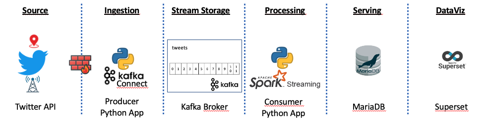

# Ukraine_tweets


# Project Motivation

Thursday, February 24, 2022 Russian army invades Ukraine and marks the beginning of a war that threatens Western countries, accompanied by a humanitarian refugee crisis. The purpose of this project is to obtain the Geolocation of Ukrainian Twitter Users. One of the limitations to using Twitter is that only about 1% of tweets are geotagged with the tweet's location, which can make much of this work very difficult.

### Assignment Description
Our dearly Stream Processing & Real-Time Analytics professor Raul Marín has proposed us a challenge. To deploy an end-to-end real-time solution following the next stages throughout the pipeline:<br>
  1- Select the **Data Source**: Twitter API.<br>
  2- **Ingestion**: Producer - Python app.<br>
  3- **Stream Storage**: Broker - Kafka.<br>
  4- **Processing**: Consumer - Spark Streaming.<br>
  5- **Serving**: Relational DB - MariaDB.<br>
  6- **Visualization**: Superset.<br>

### Who are we?
IE Students of the MSc Business Analytics & Big Data. Team Power Rangers:
  - Isobel Rae Impas
  - Jan P. Thoma
  - Camila Vasquez
  - Santiago Alfonso Galeano
  - Miguel Frutos

# Ukraine_tweets
### 1- Select the Data Source: Twitter API
Setting up Twitter. You need to create a "Twitter App". Follow the next steps:
- Visit [Projects & Apps](https://developer.twitter.com/en/portal/projects-and-apps) section in the Developer Portal
- Sign into your account. (if you dont have one you should create it).
- Click the “Create an app” button.
- Fill-in the form (at least required fields).
- Grab the details to setup the ingestion script later on.
- Once you’re in, click the “Create an app” button to start the process.
- Fill-in required fields.
- If all goes well, your Twitter App should be created and the API Key, API Secret Key will show up.
- The Access Token and Access Token Secret will be also needed.

Fill up the **credentials.ini** file with the required fields.

### 2- Ingestion - Producer (Python app)
[Tweepy](http://www.tweepy.org/)  is a python wrapper for the Twitter API that allowed us to easily collect tweets in real-time.

Initiate the Kafka broker in the terminal:
```
sudo service kafka start
sudo service kafka status
```
The following python script is the producer, named as twitter_producer.py, we will use it to ingest the tweets into Kafka topic "tweets". To call it we should write in our terminal the following piece of code.

```
python3 twitter_producer.py credentials.ini -b localhost:9092 -t tweets
```
FILE *(twitter_producer.py)* :
```python
"""
Description: Scan the latest twitter feeds originating from a particular country, using Twitter’s Streaming API. The program creates a json file which stores raw twitter streams for an specific bounding box.

Required Packages: tweepy, argparse, time, string, json, prettytable

Usage: python3 twitter_producer.py credentials.ini -b localhost:9092 -t tweets

Note: Fill up the variable in credentials.ini which contains data path and twitter app credentials.
Note: Fill up the LOCATION variable for changing the country bounding box. By default for this project would be "Ukraine".

"""
import configparser, argparse, logging, socket, tweepy, socket, sys

from confluent_kafka import Producer
from tweepy.streaming import Stream

# Auxiliary classes
#
class TwitterStreamListener(tweepy.Stream):
    """tweepy.Stream is a class provided by tweepy used to access
    the Twitter Streaming API to collect tweets in real-time.
    """
    _kafka_producer = None
    _topic = None
    
    def connect_to_kafka(self, broker, topic):
        """The Producer is configured using a dictionary. Added the topic inside the funtion"""
        conf = {'bootstrap.servers': broker,
                'client.id': socket.gethostname()}        
        self._kafka_producer = Producer(conf)
        self._topic = topic
  
    def on_data(self, data):
        """Add the logic you want to apply to the data. This method is called whenever new data arrives from live stream.
        We synchronously push this data to kafka queue (using produce and flush)"""
        if self._kafka_producer!=None:
            self._kafka_producer.produce(self._topic, value=data) #method enqueues message immediately for batching, compression and transmission to broker, no delivery notification events will be propagated until flush() is invoked.
            self._kafka_producer.flush() #Wait for all messages in the Producer queue to be delivered. This is a convenience method that calls poll() until len() is zero or the optional timeout elapses. flush() will block until the previously sent messages have been delivered (or errored), effectively making the producer synchronous.
            logging.debug(f"tweet: {data}")
        else:
            print(data)

    def on_error(self, status):
        """On error - if an error occurs, display the error / status"""
        #logging.error(status)
        print("Error received in kafka producer " + repr(status))
        return sys.exit(-1) ## Don't kill the stream. tells the program to quit,it stops from continuoing the execution
 
   
# Body of the scripts       
#
if __name__ == '__main__':
    #Parse the argument given in the commandline
    logging.basicConfig(level=logging.INFO) #Logging is a means of tracking events that happen when some software runs
    parser = argparse.ArgumentParser(description="Scanning Twitter Stream")
    parser.add_argument("credentials_file", 
                         help="path to the file with info to access the service")
    parser.add_argument("-b", "--broker",
                            help="server:port of the Kafka broker where messages will be published")
    parser.add_argument("-t", "--topic",
                            help="topic where messages will be published")  
    args = parser.parse_args()   

  # Read credentials.ini to connect to the Twitter Stream
  #
    credentials = configparser.ConfigParser()
    credentials.read(args.credentials_file)
        
    API_key = credentials['DEFAULT']['API_key']
    API_secret = credentials['DEFAULT']['API_secret']
    access_token = credentials['DEFAULT']['access_token']
    access_secret = credentials['DEFAULT']['access_secret']
    
  # Twitter connection and Kafka producer initialization
  #  
    twitter_conn = TwitterStreamListener(API_key, API_secret,
                                         access_token, access_secret)
    
  # Initialize the Kafka producer if broker and topic was specified
if args.broker != None and args.topic != None:
    twitter_conn.connect_to_kafka(args.broker, args.topic)
    # Start the filtering. Bounding Boxes by country : https://gist.github.com/graydon/11198540
    # LOCATIONS are the longitude, latitude coordinate corners for a box that restricts the 
    # geographic area from which you will stream tweets. The first two define the southwest
    # corner of the box and the second two define the northeast corner of the box. 
    LOCATION = (22.0856083513, 44.3614785833, 40.0807890155, 52.3350745713) #Ukraine
    twitter_conn.filter(locations=LOCATION)
    twitter_conn.sample()


```
### 3- Stream Storage: Broker (Kafka)


### 4- Processing: Consumer (Spark Streaming)


### 5- Serving: Relational DB (MariaDB)


### 6- DataViz: Superset

# Insights


# Final Notes


# Bibliography
- Project by Raul Marin & Hupperich-Manuel https://github.com/raulmarinperez/bsdprof/tree/main/big_data/stream_processing/templates/twitter
- Project by Shawn Terryah https://github.com/shawn-terryah/Twitter_Geolocation
- Project by TuringTester https://github.com/TuringTester/Twitter-Data-Mining-Python
- Bounding Boxes by country https://gist.github.com/graydon/11198540
